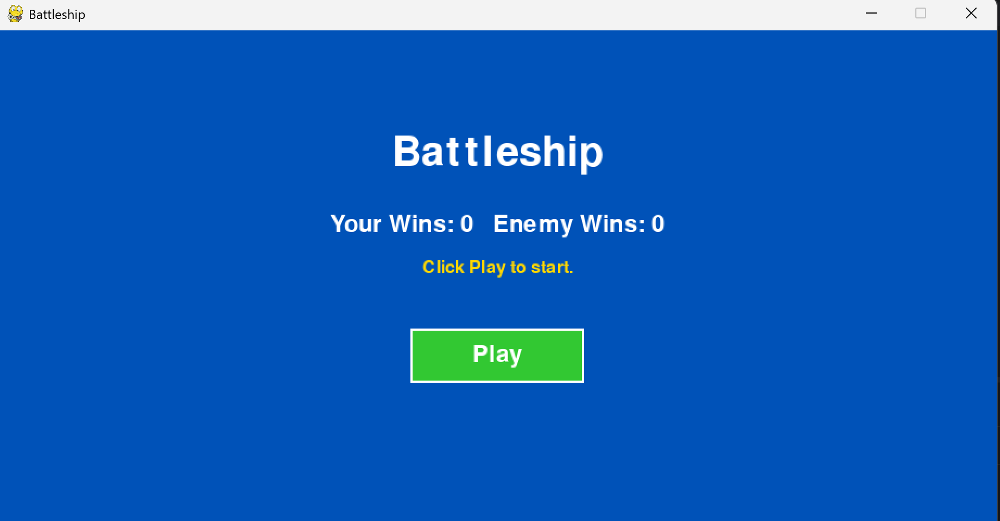
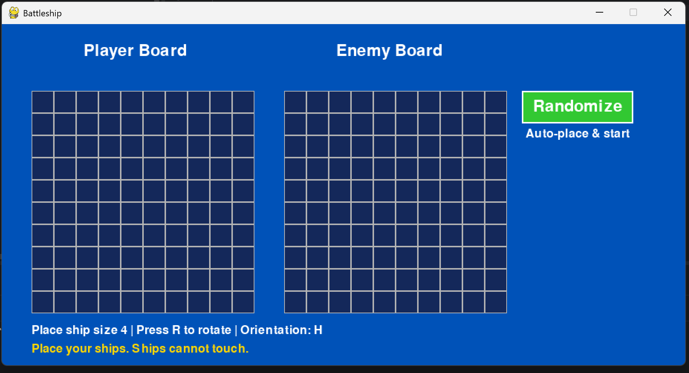
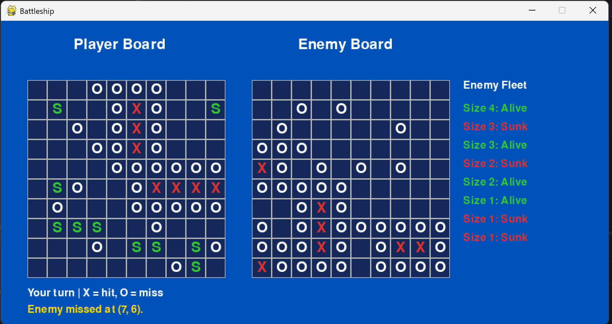
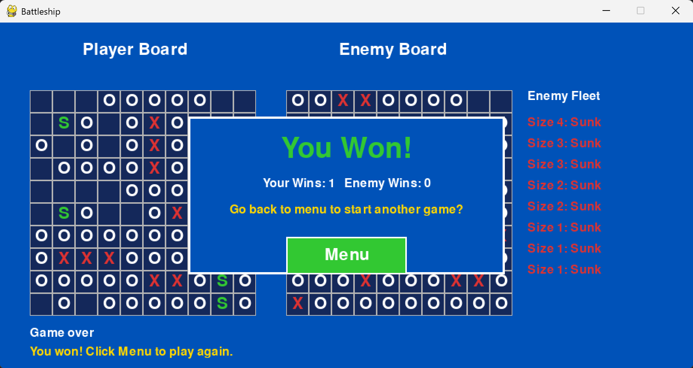

# Battleship

A desktop Battleship game built in Python with Pygame — classic rules, a computer opponent that actually hunts down your ships once it lands a hit, sound effects, and background music that gets more intense as you take damage.

## Features

- **Classic 10x10 Battleship** — one 4-length ship, two 3-length, two 2-length, and three 1-length ships per side.
- **No-touching placement rule** — ships can't be placed adjacent to each other, not even diagonally, so there's no free information from clustering.
- **Smart computer opponent** — the AI attacks randomly until it lands a hit, then switches into a hunt mode: it tries the four neighboring cells, figures out the ship's orientation from two hits, and finishes it off in a line. It's noticeably harder to beat than a purely random opponent.
- **Manual or instant setup** — place all 8 ships yourself (click to place, `R` to rotate), or hit the Randomize button to auto-place your fleet and jump straight into battle.
- **Adaptive music** — the soundtrack escalates as the enemy sinks more of your ships, plus dedicated victory and defeat tracks.
- **Sound effects** for hits, misses, and sunk ships.
- **Persistent win/loss tally** shown on the menu screen across games in the same session.

## Screenshots

| Menu | Ship placement |
| --- | --- |
|  |  |

| Battle | Game over |
| --- | --- |
|  |  |

## Requirements

- Python 3.9+
- [Pygame](https://www.pygame.org/)

## Setup

```bash
git clone https://github.com/EtRub6/PythonBattleShip.git
cd PythonBattleShip
pip install -r requirements.txt
python main.py
```

## How to play

1. **Place your fleet.** Click on your board (left side) to place each ship in turn. Press `R` to rotate between horizontal and vertical before placing. Ships can't touch each other, including diagonally. Don't want to place manually? Click **Randomize** to auto-place your whole fleet and start the battle immediately.
2. **Attack.** Once placement is done, click a cell on the enemy board (right side) to fire. A hit shows as a red `X`, a miss as a white `O`, and you go again after a hit — just like the real rules.
3. **Watch out.** The computer plays the same way you should: once it hits one of your ships, it won't stop probing that area until the ship is sunk.
4. **Win or lose,** you're taken to a summary screen with your running win/loss record, and a button back to the menu to play again.

Press `Esc` at any time to quit.

## Project structure

```text
PythonBattleShip/
├── main.py           # Entry point — creates and runs the Game
├── game.py            # Game state machine: menu, placement, battle, game over
├── board.py           # Board grid, ship placement, and attack resolution
├── ship.py            # Ship class — tracks size, cells, and hits
├── player.py          # Player class
├── enemy.py           # Computer opponent — hunt/target attack AI
├── renderer.py        # All Pygame drawing, kept separate from game logic
├── sound_manager.py   # Music and sound effect playback
├── settings.py        # Shared constants (grid size, colors, layout)
└── sounds/            # Music and sound effect files
```

The split between `game.py` (state and rules) and `renderer.py` (drawing) was intentional — it keeps the game logic testable without touching Pygame at all, which is how the AI and board logic ended up being straightforward to verify independently of the graphics.

## Credits

Built by Ethan Rubinstein.

## License

MIT — see [LICENSE](LICENSE).
